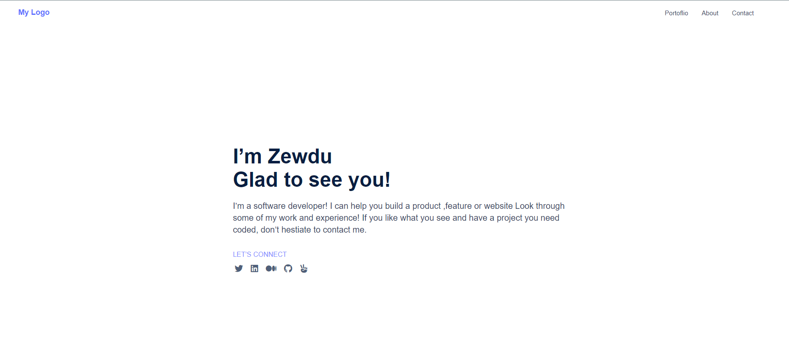
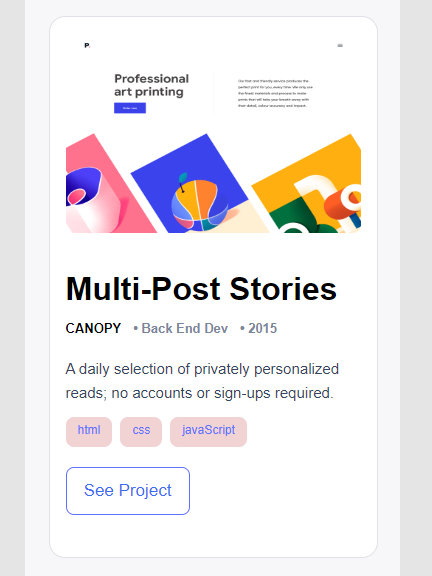

<!--
HOW TO USE:
This is an example of how you may give instructions on setting up your project locally.

Modify this file to match your project and remove sections that don't apply.

REQUIRED SECTIONS:
- Table of Contents
- About the Project
  - Built With
  - Live Demo
- Getting Started
- Authors
- Future Features
- Contributing
- Show your support
- Acknowledgements
- License

After you're finished please remove all the comments and instructions!
-->

  <h3><b>Mobile first Personal Portfolio page</b></h3>

<!-- TABLE OF CONTENTS -->

# 📗 Table of Contents

- [📖 About the Project](#about-project)
  - [:camera: project screenshot]("screen-shoot")
  - [🛠 Built With](#built-with)
    - [Tech Stack](#tech-stack)
    - [Key Features](#key-features)
  - [🚀 Live Demo](#live-demo)
- [💻 Getting Started](#getting-started)
  - [Setup](#setup)
  - [Prerequisites](#prerequisites)
- [👥 Authors](#authors)
- [🙏 Acknowledgements](#acknowledgements)
- [📝 License](#license)

<!-- PROJECT DESCRIPTION -->

# 📖 Personal portfolio page 

> This project is a website for a personal portfolio that complies with responsive web design guidelines to display on desktop and mobile screens.

## :camera: Project screenshots 

<h5>Desktop version</h5>

<h5>Mobile version</h5>

 

## 🛠 Built With <a name="built-with">

HTML5 and CSS in addition it used figma ui template</a>

### Tech Stack 

> HTML 5 , CSS flex box and CSS grid.

<!-- Features -->

### Key Features 

>

- mobile first approach
- flex box
- interactive button
- CSS grid
- CSS Animation

(<a href="#readme-top">back to top</a>)
<!-- LIVE DEMO -->

## 🚀 Live Demo 

> To view a live demo, click the link below.

- [Live Demo Link](https://zewdu444.github.io/personal_portfolio/index.html)

(<a href="#readme-top">back to top</a>)

<!-- GETTING STARTED -->

## 💻 Getting Started 

> to run on your localhost just copy the whole project and open index.html in your browser.

### Prerequisites

In order to run this project you only need:

- latest web-browser

### Setup

> git clone https://github.com/zewdu444/personal_portfolio.git
> cd personal_portfolio

(<a href="#readme-top">back to top</a>)

<!-- AUTHORS -->

## 👥 Authors 

👤 **zewdu erkyhun**

- GitHub: [@zewdu444](https://github.com/zewdu444)
- Twitter: [@zewdu444](https://twitter.com/zewdu444)
- LinkedIn: [zewdu-erkyhun](https://www.linkedin.com/in/zewdu-erkyhun-081378b3/)

<!-- ACKNOWLEDGEMENTS -->

## 🙏 Acknowledgments 

> I would like to thank Microverse team

(<a href="#readme-top">back to top</a>)

<!-- LICENSE -->

## 📝 License 

This project is [MIT](./LICENSE) licensed.

(<a href="#readme-top">back to top</a>)

